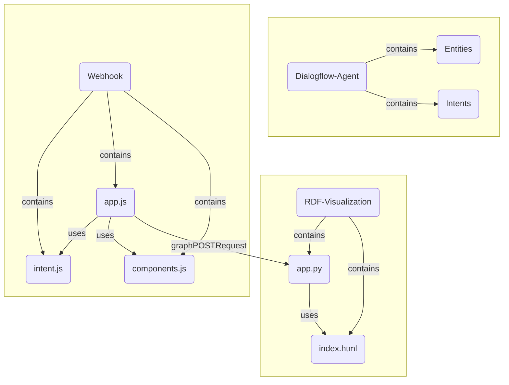

# DBpedia Question Answering System
A Question Answering pipeline to provide users with richer responses.   

This repository will provide the implementation of the project proposed using the title 
"[Understanding and Optimizing DBpedia Question Answering through Explanations](https://forum.dbpedia.org/t/understanding-and-optimizing-dbpedia-question-answering-through-explanations-gsoc2022/1628)" that is funded by the [Google Summer of Code program](https://summerofcode.withgoogle.com/programs/2022/projects/xMuRURaT).

The project is carried out by [Jayesh Desai](https://github.com/UditArora2000). 

The project Supervision and support is done by:

* [Andreas Both](https://github.com/anbo-de)
* [Alexander Perevalov](https://github.com/Perevalov)
* [Ricardo Usbeck](https://github.com/RicardoUsbeck)
* [Ram Athreya](https://github.com/ram-g-athreya)

Use cases of the future QA system:

* Users will be able to see if their intended entities have been correctly identified by the QA system. If not the users can accordingly rephrase their questions to get the desirable results.
* Users will be made aware of alternative answers in the event of the predicted answers having a low confidence score.
* Users would have the option to improve/modify their queries in case the information user requested for is not present with in the DBpeda Knowledge Graph.

Visualization of the current QA system:
